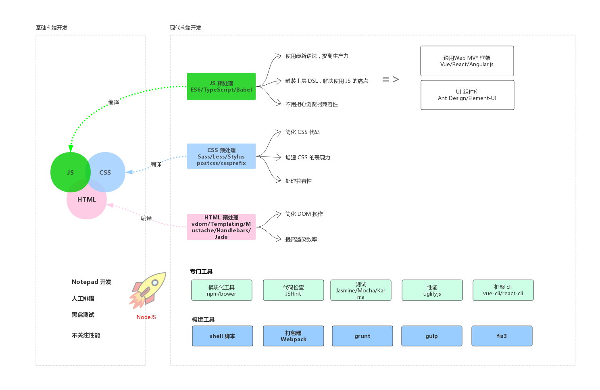

# 概述

## 本书目的

1. 梳理前端开发中用到的各类工具，务求准确清晰地理解它们
2. 了解这些工具的运行原理

## 前端开发概览

**如图所示：**

前端开发本质上还是包含三个方面：JavaScript / HTML / CSS。早期的前端开发，我们只需要写一个 html 文件，然后在里面引入 CSS / JS 文件就可以了。但是所谓的现代前端开发，远远不是那么简单了。

**为什么前端开发变得那么复杂呢？**

我觉得有两个原因：

1. 前端应用变得越来越复杂，原生 JS / CSS / HTML 的表现力不够用了
3. 浏览器兼容。

得益于 nodeJS 与编译技术，出现了很多上层的 DSL 语言，极大地释放了前端的生产力。
