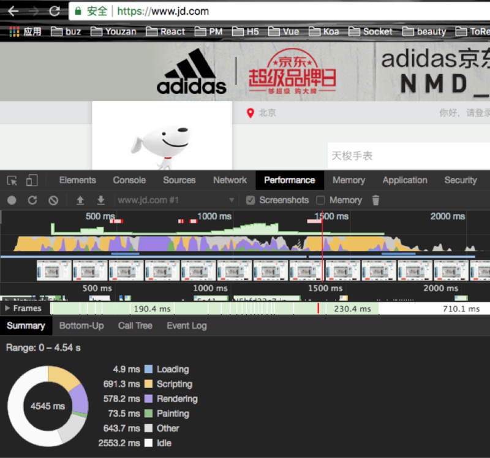

# 虚拟 DOM

之所以这里简要介绍一下虚拟DOM，是因为它本质上也是处理 html 相关的问题。

目前流行的两个框架 React/Vue，都使用 v-dom 技术来提高页面的渲染效率。

这里为了简单，把 v-dom 简称 VD。

## VD 是什么

本质上来说，VD只是一个简单的JS对象，并且最少包含 tag、props 和 children 三个属性。

不同的框架对这三个属性的命名会有点差别，但表达的意思是一致的。它们分别是标签名（tag）、属性（props）和子元素对象（children）。

下面是一个典型的VD对象例子：

```javascript
{
  tag: "div",
  props: {},
  children: [
    "Hello World",
    {
      tag: "ul",
      props: {},
      children: [{
        tag: "li",
        props: {
          id: 1,
          class: "li-1"
        },
        children: ["第", 1]
      }]
    }
  ]
}
```
VD跟 dom 对象有一一对应的关系，上面的VD是由以下的HTML生成的

```html
<div>
  Hello World
  <ul>
    <li id="1" class="li-1">
      第1
    </li>
  </ul>
</div>
```

一个 dom 对象，比如li，由tag(li), props({id: 1, class: "li-1"})和children(["第", 1])三个属性来描述。


## 为什么需要VD

VD 最大的特点是将页面的状态抽象为 JS 对象的形式，配合不同的渲染工具，使**跨平台渲染**成为可能。

如: React 就借助 VD 实现了服务端渲染、浏览器渲染和移动端渲染等功能。

此外，在进行页面更新的时候，借助VD，DOM 元素的改变可以在内存中进行比较，再结合框架的事务机制将多次比较的结果合并后一次性更新到页面，从而**有效地减少页面渲染的次数，提高渲染效率**。

我们先来看下页面的更新一般会经过几个阶段。


从上面的例子中，可以看出页面的呈现会分以下3个阶段：

- JS计算
- 生成渲染树
- 绘制页面

这个例子里面，JS计算用了691毫秒，生成渲染树578毫秒，绘制73毫秒。如果能有效的减少生成渲染树和绘制所花的时间，更新页面的效率也会随之提高。

通过VD的比较，我们可以将多个操作合并成一个批量的操作，从而减少dom重排的次数，进而缩短了生成渲染树和绘制所花的时间。

## 如何实现VD与真实DOM的映射

我们先从如何生成VD说起。借助JSX编译器，可以将文件中的HTML转化成函数的形式，然后再利用这个函数生成VD。看下面这个例子：

```js
function render() {
    return (
        <div>
            Hello World
            <ul>
                <li id="1" class="li-1">
                    第1
                </li>
            </ul>
        </div>
    );
}
```
这个函数经过JSX编译后，会输出下面的内容：
```js
function render() {
    return h(
        'div',
        null,
        'Hello World',
        h(
            'ul',
            null,
            h(
                'li',
                { id: '1', 'class': 'li-1' },
                '\u7B2C1'
            )
        )
    );
}
```
这里的h是一个函数，可以起任意的名字。这个名字通过babel进行配置：

```json
{
  "plugins": [
    ["transform-react-jsx", {
      "pragma": "h"  
    }]
  ]
}
```
接下来，我们只需要定义h函数，就能构造出VD
```js
function flatten(arr) {
    return [].concat.apply([], arr);
}

function h(tag, props, ...children) {
    return {
        tag,
        props: props || {},
        children: flatten(children) || []
    };
}
```
h函数会传入三个或以上的参数，前两个参数一个是标签名，一个是属性对象，从第三个参数开始的其它参数都是children。children元素有可能是数组的形式，需要将数组解构一层。比如：
```js
function render() {
    return (
        <ul>
            <li>0</li>
            {
                [1, 2, 3].map( i => (
                    <li>{i}</li>
                ))
            }
        </ul>
    );
}

// JSX编译后
function render() {
    return h(
        'ul',
        null,
        h(
            'li',
            null,
            '0'
        ),
        /*
         * 需要将下面这个数组解构出来再放到children数组中
         */
        [1, 2, 3].map(i => h(
            'li',
            null,
            i
        ))
    );
}
```
继续之前的例子。执行h函数后，最终会得到如下的VD对象：
```js
{
    tag: "div",
    props: {},
    children: [
        "Hello World",
        {
            tag: "ul",
            props: {},
            children: [{
                tag: "li",
                props: {
                    id: 1,
                    class: "li-1"
                },
                children: ["第", 1]
            }]
        }
    ]
}
```
下一步，通过遍历VD对象，生成真实的dom
```js
// 创建dom元素
function createElement(vdom) {
    // 如果vdom是字符串或者数字类型，则创建文本节点，比如“Hello World”
    if (typeof vdom === 'string' || typeof vdom === 'number') {
        return doc.createTextNode(vdom);
    }

    const {tag, props, children} = vdom;

    // 1. 创建元素
    const element = doc.createElement(tag);

    // 2. 属性赋值
    setProps(element, props);

    // 3. 创建子元素
    // appendChild在执行的时候，会检查当前的this是不是dom对象，因此要bind一下
    children.map(createElement)
            .forEach(element.appendChild.bind(element));

    return element;
}

// 属性赋值
function setProps(element, props) {
    for (let key in props) {
        element.setAttribute(key, props[key]);
    }
}
```
createElement函数执行完后，dom元素就创建完并展示到页面上了

## dom diff

使用 VD 的框架，一般的设计思路都是页面等于页面状态的映射，即 UI = render(state)。当需要更新页面的时候，无需关心 DOM 具体的变换方式，只需要改变state即可，剩下的事情（render）将由框架代劳。

我们考虑最简单的情况，当 state 发生变化时，我们重新生成整个 VD ，触发比较的操作。

上述过程分为以下四步：

- state 变化，生成新的 VD
- 比较 VD 与之前 VD 的异同
- 生成差异对象（patch）
- 遍历差异对象并更新 DOM

差异对象的数据结构是下面这个样子，与每一个 VDOM 元素一一对应：

```js
{
    type,
    vdom,
    props: [{
               type,
               key,
               value
            }]
    children
}
```
最外层的 type 对应的是 DOM 元素的变化类型，有 4 种：新建、删除、替换和更新。props 变化的 type 只有2种：更新和删除。

枚举值如下：

```js
const nodePatchTypes = {
    CREATE: 'create node',
    REMOVE: 'remove node',
    REPLACE: 'replace node',
    UPDATE: 'update node'
}

const propPatchTypes = {
    REMOVE: 'remove prop',
    UPDATE: 'update prop'
}
```

https://segmentfault.com/a/1190000016145981
