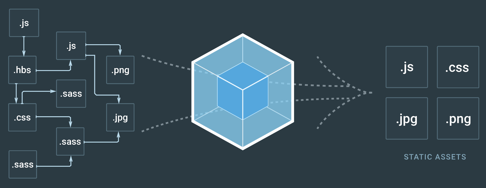

# webpack

## what

Webpack is：
- a **module bundler** and not a task runner.
- a **static** build tool, not a module loader.

前端模块管理工具/打包器。它将前端资源 js/css/html/image/fonts等，打包成 js  模块，然后统一管理。
https://webpack.js.org/


Webpack是JS应用程序的模块(资源)打包器，它把JS应用程序开发过程中的所有资源都看作一个模块，包括JS、CSS、图片等。它在运行时递归地解析所有模块的依赖关系，构建依赖关系图，而后产生一个bundle.js，供浏览器直接加载。

特点：
- 所有的都是模块
- 本身仅识别JavaScript(有编译过程，其它资源不解析或通过第三方插件解析)
- 模块相对独立，相互依赖
- 打包过程高度可配置



## 核心概念

### entry
The contextual root of your app.

The first js file to load to ‘kick-off’ your app in the browser.

### output
Tells webpack where and how to distribute bundles.

### loader
Tells webpack how to load files in your content base.

### plugins
a class/function, which apply functionality at the compilation level

a plugin is an ES5 ‘class’ which implements an apply function, the compiler uses it to emit events.

80% of webpack is made up of its own plugin system.


WebPack自动 vue 组件全局注册（扫描组件目录）:

```javascript
import Vue from 'vue'
import upperFirst from 'lodash/upperFirst'
import camelCase from 'lodash/camelCase'
const requireComponent = require.context(
  // 其组件目录的相对路径
  './components',
  // 是否查询其子目录
  false,
  // 匹配基础组件文件名的正则表达式
  /Base[A-Z]\w+\.(vue|js)$/
)
requireComponent.keys().forEach(fileName => {
  // 获取组件配置
  const componentConfig = requireComponent(fileName)
  // 获取组件的 PascalCase 命名
  const componentName = upperFirst(
    camelCase(
      // 剥去文件名开头的 `./` 和结尾的扩展名
      fileName.replace(/^\.\/(.*)\.\w+$/, '$1')
    )
  )
  // 全局注册组件
  Vue.component(
    componentName,
    // 如果这个组件选项是通过 `export default` 导出的，
    // 那么就会优先使用 `.default`，
    // 否则回退到使用模块的根。
    componentConfig.default || componentConfig
  )
})

```


## 代码切割

Src — code split —> bundle  然后这些 bundle 就可以被按需加载，或并行加载。
代码切割的方式：
1.webpack entry
   这种方式的问题：1. 多个 bundle 中可能存在重复的 chunk.  2. 它本身是静态的，不能实现动态异步加载。
2.提取公共代码，已被整合到 webpack v4 的代码优化版块。
3.动态加载 import
附加功能：
Parent Chunk 中  Prefetch 后续可能用到的 chunk.


## webpack cli
webpack -p ：prd模式的编译.
全写：webpack --optimize-minimize --define process.env.NODE_ENV="'production'"


## tree-shaking
其实也确实不是什么特别神的东西，原理而言 @顾轶灵 的回答已经讲得比较清楚了，我想指出的一点就是不管是 rollup 还是 webpack 2，tree-shaking 都是因为 ES6 modules 的静态特性才得以实现的。ES6 modules 的 import 和 export statements 相比完全动态的 CommonJS require，有着本质的区别。举例来说：
1. 只能作为模块顶层的语句出现，不能出现在 function 里面或是 if 里面。（ECMA-262 15.2)
2. import 的模块名只能是字符串常量。(ECMA-262 15.2.2)
3. 不管 import 的语句出现的位置在哪里，在模块初始化的时候所有的 import 都必须已经导入完成。换句话说，ES6 imports are hoisted。(ECMA-262 15.2.1.16.4 - 8.a)
4. import binding 是 immutable 的，类似 const。比如说你不能 import { a } from './a' 然后给 a 赋值个其他什么东西。(ECMA-262 15.2.1.16.4 - 12.c.3)
这些设计虽然使得灵活性不如 CommonJS 的 require，但却保证了 ES6 modules 的依赖关系是确定 (deterministic) 的，和运行时的状态无关，从而也就保证了 ES6 modules 是可以进行可靠的静态分析的。对于主要在服务端运行的 Node 来说，所有的代码都在本地，按需动态 require 即可，但对于要下发到客户端的 web 代码而言，要做到高效的按需使用，不能等到代码执行了才知道模块的依赖，必须要从模块的静态分析入手。这是 ES6 modules 在设计时的一个重要考量，也是为什么没有直接采用 CommonJS。
正是基于这个基础上，才使得 tree-shaking 成为可能（这也是为什么 rollup 和 webpack 2 都要用 ES6 module syntax 才能 tree-shaking），所以说与其说 tree-shaking 这个技术怎么了不起，不如说是 ES6 module 的设计在模块静态分析上的种种考量值得赞赏。
https://www.zhihu.com/question/41922432


## 插件列表
LoaderOptionsPlugin    :    
由于webpack2+已不允许扩展webpack配置，此插件提供了一种方式，把option 传递给所有loader
https://webpack.js.org/plugins/loader-options-plugin/

DefinePlugin    :    
扫描所有源代码，执行搜索替换的操作。


## loader
* Loaders can be chained. They are applied in a pipeline to the resource. A chain of loaders are compiled chronologically. The first loader in a chain of loaders returns a value to the next. At the end loader, webpack expects JavaScript to be returned.
* Loaders can be synchronous or asynchronous.
* Loaders run in Node.js and can do everything that’s possible there.
* Loaders accept query parameters. This can be used to pass configuration to the loader.
* Loaders can also be configured with an options object.
* Normal modules can export a loader in addition to the normal main via package.json with the loader field.
* Plugins can give loaders more features.
* Loaders can emit additional arbitrary files.

loader类别
Sync Loader
Async Loader
Raw Loader
Pitching Loader

loader上下文

## 热加载
